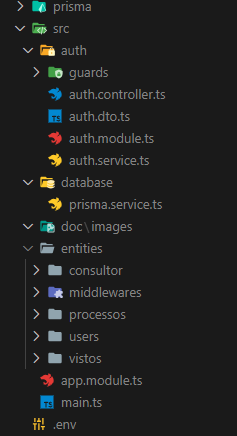
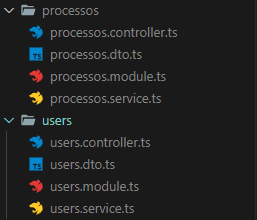
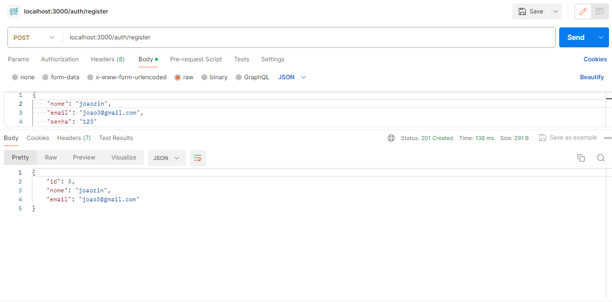
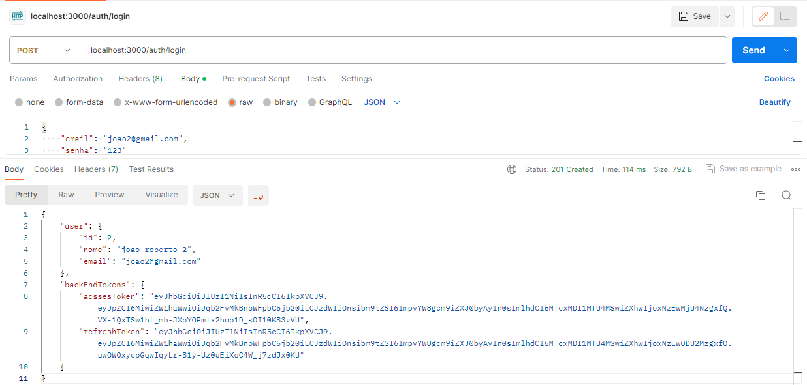
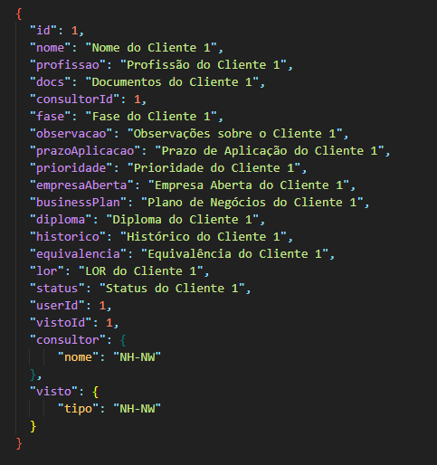
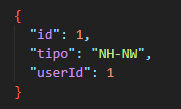
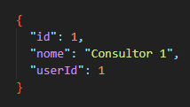

# API da aplicação de controle de clientes


#### Dependencias
*  "ts-node": "^10.9.1"
*  "prisma": "^5.10.2"
*  "@nestjs/cli": "^10.0.0"

## Estrutua de pastas


> Dentro da arquitetura usada, temos as estruturas de autorização desacopladas das entidades, e a mesma coisa da conexão com o banco de dados (SQLite).



> Entities: Entidades as quais vão ser manipuladas pelo prisma (tabelas do banco de dados)
 * Dentro de cada entidade, existe uma estrutura padrão do nestJS, onde temos; Controller, DTO, Module, Service.




## Requisições (Formato JSON)


> Dentro do projeto existem 4 entidades, onde cada uma tem uma forma diferente de fazer requisições. Eis um breve resumo.

* Registro de novos usuários


* Login


* GET processo


* GET visto


* GET consultor



## Instalação

```bash
$ npm i
```

## Rodando o app 

```bash
# development
$ npm run start

# watch mode
$ npm run start:dev

# production mode
$ npm run start:prod
```


